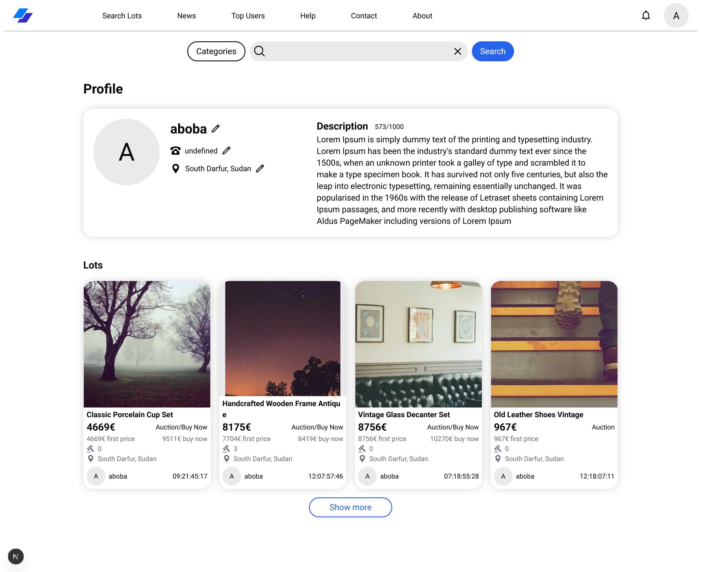
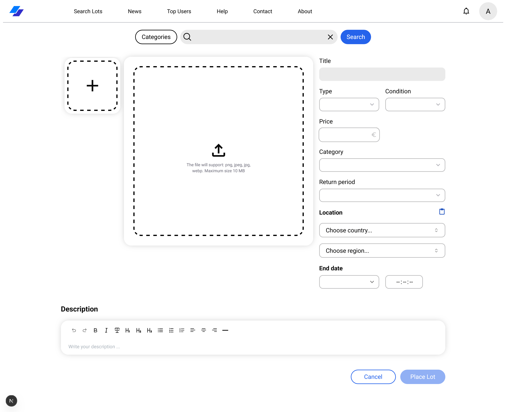

# 🛒 Tradio — Hybrid Online Auction Platform

**Tradio** is an online auction website where anyone can discover and sell a wide range of items.
The platform offers multiple listing types — standard auctions, mixed auctions, and one-time direct sales.

## 🖼️ Screenshots

| Home Page                            |
| ------------------------------------ |
|    |
| Product Page                         |
|  |
| User Profile                         |
|  |
| Create Lot                           |
|  |

---

## 🧰 Tech Stack

**Frontend:**

- NodeJs
- ReactJs / NextJs
- TypeScript
- Zustand
- Tailwind CSS
- Shadcn UI
- TipTap Editor
- react-hook-form + zod
- date-fns, lodash, validator, i18n

**Backend:**

- TypeScript
- NestJS
- Prisma
- PostgreSQL
- Redis
- Bull
- Socket.io
- AWS S3(LocalStack)
- GraphQL
- class-validator
- class-transformer
- React Email
- Argon2
- express-session
- cookie-parser
- Axios
- GeoIP
- Device Detector
- lodash

---

## ⚙️ Installation & Setup

### 1. Clone the repository

```bash
git clone https://github.com/HackZem/tradio.git
cd tradio
```

---

### 2. Run Docker (Database + Redis)

Make sure you have Docker installed.

```bash
cd backend
docker-compose up -d
```

This will start:

- PostgreSQL database
- Redis server
- LocalStack server

---

### 3. Install dependencies

**Backend:**

```bash
cd backend
npm install
```

**Frontend:**

```bash
cd ../frontend
npm install
```

---

### 4. Setup environment variables

The .env.dev file in **backend** is preconfigured with default values; however, some additional fields need to be set:

```env
MAIL_HOST=
MAIL_PORT=
MAIL_LOGIN=
MAIL_PASSWORD=
```

---

### 5. Run database migrations / push schema

```bash
cd backend
npm run db:push
```

---

### 6. Seed the database (optional)

```bash
npm run db:seed
```

---

### 7. Start the backend

**Development mode (with watch):**

```bash
npm run start:dev
```

Backend will run on:

```
http://localhost:3000
```

---

### 8. Start the frontend

```bash
cd ../frontend
npm run dev
```

Frontend will run on:

```
http://localhost:5173
```

## 📄 License

This project is licensed under the [MIT License](./LICENSE).
